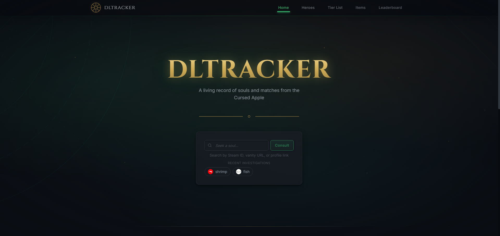
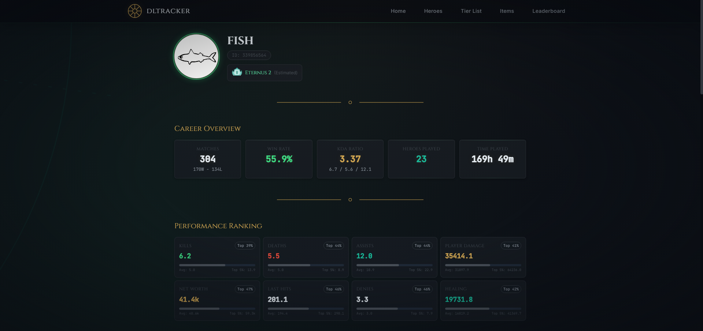
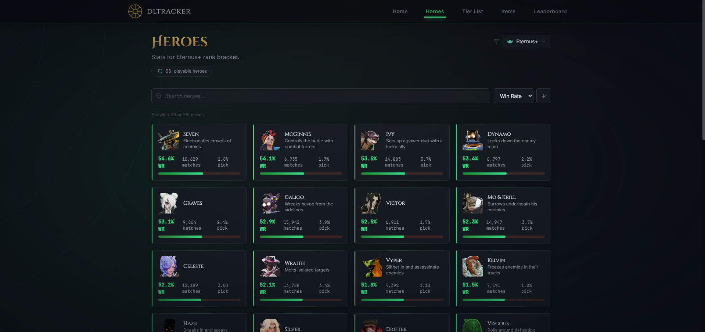
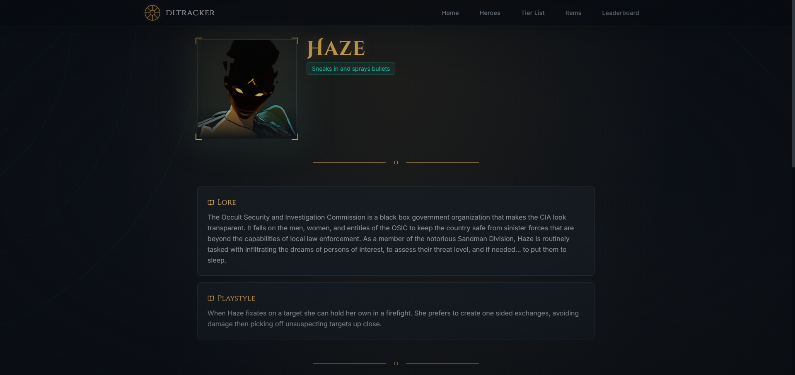
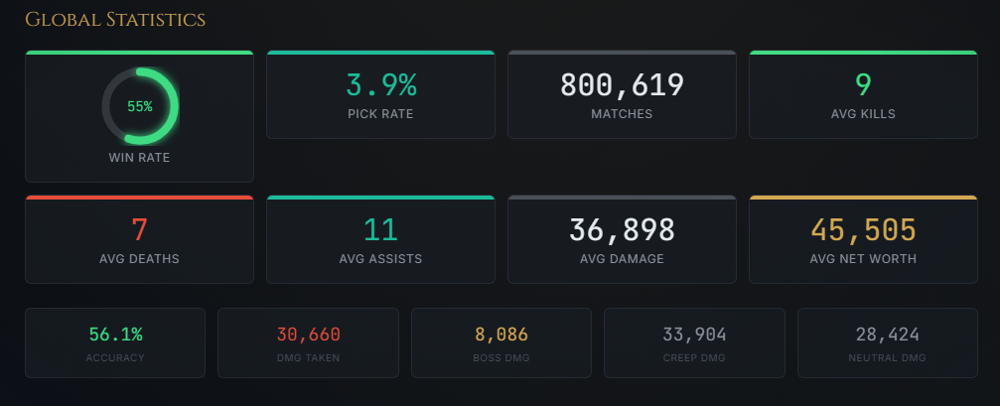
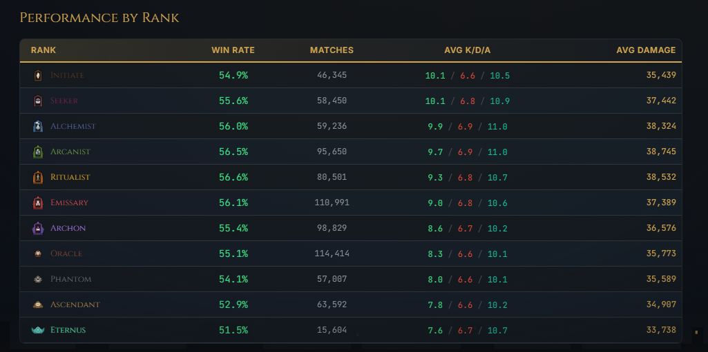
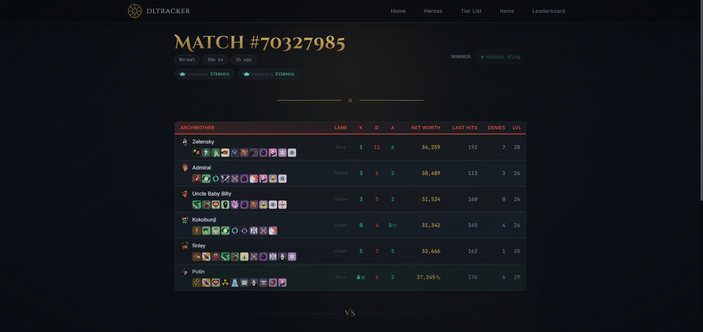
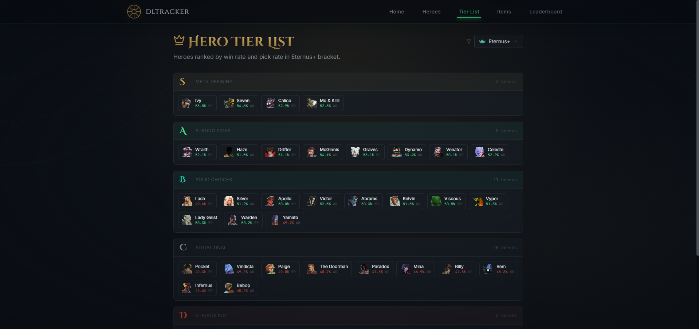
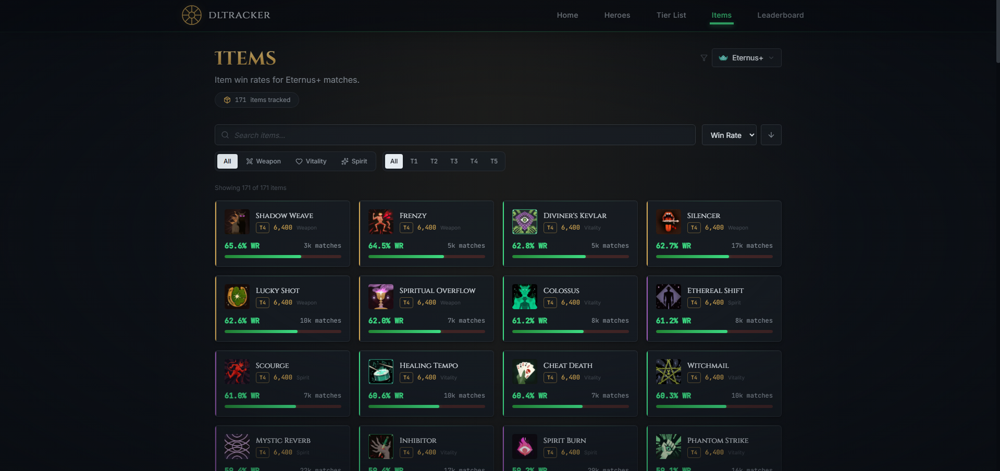
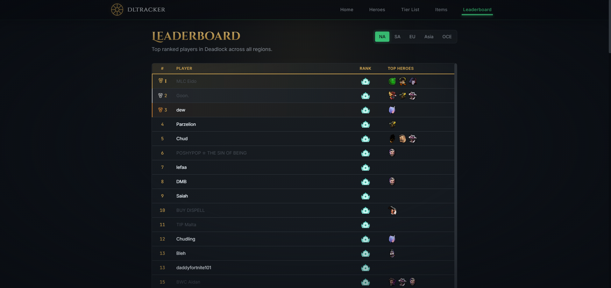

<div align="center">

# DLTRACKER

**A living record of souls and matches from the Cursed Apple.**

Track players, analyze heroes, and explore match history in Deadlock — wrapped in an atmospheric Occult Noir interface inspired by 1930s Art Deco and the supernatural.

**[dltracker.app](https://dltracker.app)**



</div>

---

## Features

### Player Profiles

Search any player by Steam ID, vanity URL, or profile link. View career stats, estimated rank, performance percentiles, top heroes, and paginated match history.



### Heroes

Browse all 38 playable heroes with global win rates, pick rates, and match counts. Filter by rank bracket. Sort by any stat.



### Hero Detail

Deep-dive into any hero with lore, playstyle descriptions, global statistics, and a full performance breakdown by rank tier.

<details>
<summary>View hero detail screenshots</summary>





</details>

### Match Detail

Full team scoreboards with K/D/A, net worth, last hits, item builds, and cross-linked players and heroes.



### Tier List

Heroes ranked into S/A/B/C/D tiers by win rate and pick rate. Filter by rank bracket to see how the meta shifts at different skill levels.



### Items

171 items tracked with win rates and match counts. Filter by type (Weapon/Vitality/Spirit) and tier.

<details>
<summary>View items screenshot</summary>



</details>

### Leaderboard

Regional rankings across NA, SA, EU, Asia, and Oceania with rank badges and top heroes.

<details>
<summary>View leaderboard screenshot</summary>



</details>

---

## Architecture

### Tech Stack

| Layer | Technology |
|-------|-----------|
| Framework | Next.js 16 (App Router, ISR, Suspense streaming) |
| Language | TypeScript (strict mode) |
| Styling | Tailwind CSS 4 (CSS-first config) |
| Animations | Framer Motion |
| Database | PostgreSQL via Prisma 6 (Supabase) |
| Cache / Rate Limiting | Upstash Redis |
| Monitoring | Sentry, Pino (structured JSON logging), Vercel Analytics |
| Validation | Zod |
| CI/CD | GitHub Actions (lint, typecheck, build) |
| Data Sources | [Deadlock Community API](https://deadlock-api.com) + Steam Web API |

### Key Engineering Decisions

- **ISR + `generateStaticParams`** for hero and match pages — pre-renders 38 hero pages at build time, caches match pages on first visit. Reduced Vercel CPU usage by ~75%.
- **Suspense streaming** on data-heavy pages — the page shell renders instantly while API data streams in, improving perceived load time.
- **Multi-signal account resolution** on the leaderboard — the Deadlock API returns ambiguous account IDs for ranked players. Built a scoring system that cross-references Steam profiles and hero play patterns to resolve the correct account.
- **In-memory promise cache** for the 2.5MB items endpoint — Next.js fetch cache has a 2MB limit, so items use a process-level cache with thundering herd protection.
- **Rank estimation from match badges** — Deadlock has no public rank API. Estimated player ranks by averaging team badge values from recent matches and mapping to rank tiers.
- **Custom design system** — "Occult Noir Ascended" theme with glassmorphism panels, animated conic-gradient borders, per-page atmospheric gradients, and glowing stat bars. All defined as CSS utilities and variables.

### Data Flow

```
User searches player name
  → Steam Vanity URL API (resolve name → Steam64 ID)
  → Steam Player Summary API (name, avatar)
  → Convert Steam64 → Account ID (subtract offset)
  → Deadlock API (hero stats, match history, performance metrics)
  → Rank estimation (badge averaging from recent matches)
  → Server-rendered profile page with ISR caching
```

---

## Design

The **Occult Noir Ascended** theme uses a dark palette with soul-green (`#3DDC84`) and amber accents, frosted glassmorphism panels, animated gradient borders on hover, and unique atmospheric radial gradients per page section. Typography pairs Cinzel Decorative (display) with JetBrains Mono (stats/data).

---

## Support

If you find dltracker useful, consider [supporting on Ko-fi](https://ko-fi.com/trazen).

## Disclaimer

This project is not affiliated with Valve Corporation. Deadlock and all related properties are trademarks of Valve Corporation.
